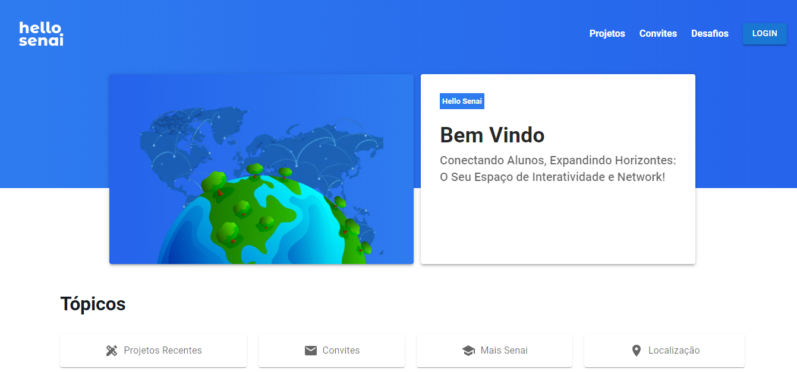

<h1 align="center">
  
</h1>

<h4 align="center"> 
	🚧  Hello Senai 🚀 Em construção...  🚧
</h4>

<p align="center">
 <a href="#sobre">Sobre</a> •
 <a href="#executar">Executar</a> • 
 <a href="#documentacao">Documentação</a> • 
 <a href="#tecnologias">Tecnologias</a> • 
 <a href="#autores">Autores</a> • 
 <a href="#licenca">Licença</a> 
</p>

<h2 style="center" id="sobre">💻 Sobre o projeto</h2>

<p style="center">O Hello Senai é um sistema construído para alunos do curso de Desenvolvimento de Sistemas do Senai.</p>
<p style="center">O sistema utiliza o Laravel como uma REST API, sendo necessário para a funcionalidade do sistema: https://github.com/GKeslley/hello_senai.</p>
<p style="center">Alunos podem:</p>

- Cadastrar o nome, email e senha.
- Postar projetos para outros alunos visualizarem.
- Realizar comentários em projetos.
- Convidar alunos para o desenvolvimento colaborativo de projetos.
- Realizar desafios postados pelos professores.
- Visualizar o perfil de outros usuários.
- Alterar o avatar.
- Desativar a conta.
  
<h2 style="center" id="executar">⚙ Como executar o projeto </h2>

### Pré-requisitos
Antes de começar, você vai precisar ter instalado em sua máquina as seguintes ferramentas: 
<ul>
  <li>Git</li>
  <li>Node.js</li>
  <li>Composer</li>
  <li>PHP ^7.4</li>
  <li>MySQL (10.4.^-MariaDB)</li>
</ul> 
Além disto é necessário importar e executar o script do banco de dados, sendo também importante um editor para trabalhar com o código como o VSCode.
<br>

```
# Clone este repositório
$ git clone https://github.com/GKeslley/hellosenai_front.git

# Acesse a pasta do projeto no seu terminal/cmd
$ cd hellosenai_front

#Instale as dependências
$ npm install
ou
$ npm install --save --legacy-peer-deps

#Inicie o servidor local
$ npm run dev
```
<h2 style="center" id="documentacao">📋 Documentação</h2>

- https://docs.google.com/document/d/1Ky9pw8wU-zHPYzfRCpNDZj1jvneTHn0T-m8eMv4Yupk/edit?usp=sharing

<h2 style="center" id="tecnologias">👨‍💻 Tecnologias</h2>

- React JS
- Laravel
- MySQL

<h2 style="center" id="autores">🛠️ Autores</h2>

- Guilherme Keslley (@GKeslley) - https://github.com/GKeslley
- Juliana Moacir (@JulianaN94) - https://github.com/JulianaN94
- Lucas Rabelo - (@lucRab) - https://github.com/lucRab
- Luis Henrique - (@QuirneeH) - https://github.com/QuirneeH

<h2 style="center" id="licenca">📝 Licença</h2>

Este projeto esta sob a licença MIT.
